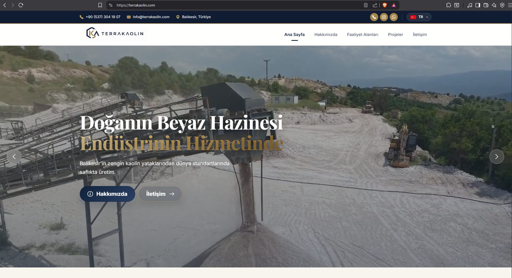
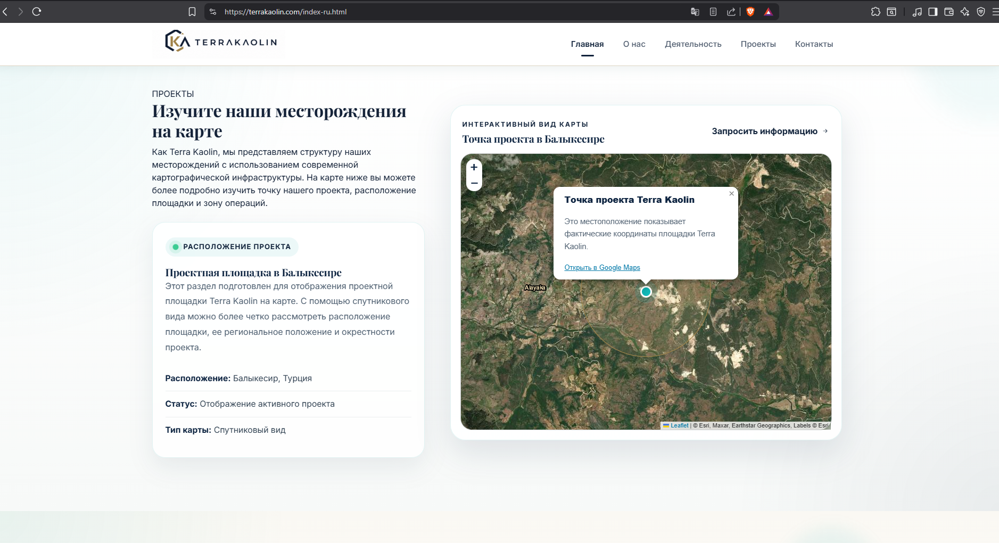
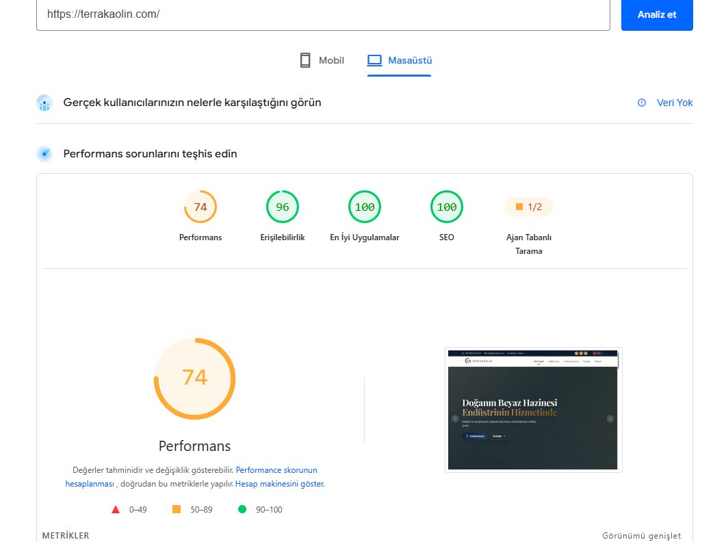

# ⛏️ Terrakaolin - Endüstriyel Madencilik Global Web Platformu

  
  
  

Bu proje, endüstriyel madencilik ve hammadde sektöründe faaliyet gösteren Terrakaolin için tasarlanmış premium kurumsal web platformudur. Proje; yüksek UI/UX standartları, interaktif API entegrasyonları ve uluslararası arama motoru optimizasyonu (International SEO) odağında geliştirilmiştir.

🔗 **[Canlı Siteyi Ziyaret Edin](https://terrakaolin.com/)**

---

## 🔥 Çekirdek Modüller ve Mühendislik Detayları

### 1. Premium UI/UX ve Kurumsal Kimlik (Frontend)
Madencilik sektörünün gerektirdiği güven ve profesyonellik hissini yansıtmak amacıyla modern, tam duyarlı (fully responsive) ve performans odaklı bir arayüz mimarisi inşa edilmiştir. Arayüz geçişleri, gereksiz DOM yüklerinden arındırılarak maksimum akıcılık sağlanmıştır.

### 2. İnteraktif API Entegrasyonu ve Lokalizasyon (Russian i18n)
Global yatırımcılar ve müşteriler için firmanın maden sahalarını (örn: Balıkesir Projesi) detaylı gösteren, uydu görünümlü interaktif harita altyapısı (Map API) sisteme entegre edilmiştir.
*   **Tam Lokalizasyon:** Harita modülü, sadece arayüz metinleriyle değil, tooltip (bilgi baloncukları) ve etkileşimli alanlarıyla birlikte doğrudan Rusça (ve İngilizce) pazarına özel olarak kodlanmıştır. Dinamik çeviri araçları yerine statik hedefleme yapılarak performans korunmuştur.

### 3. Kusursuz Lighthouse ve SEO Skorları
Proje, Google'ın Core Web Vitals metrikleri baz alınarak optimize edilmiştir. Performans testlerinde ulaşılan teknik metrikler:
*   **SEO Optimizasyonu: 100/100** (Kusursuz Meta, Canonical ve Hreflang hiyerarşisi)
*   **Best Practices (En İyi Uygulamalar): 100/100** (Güvenli bağlantılar, optimize edilmiş kaynak yönetimi)
*   **Erişilebilirlik (Accessibility): 96/100** (W3C standartlarına uygun kontrast ve ARIA etiketlemeleri)

  

---

## 🛠️ Kullanılan Teknoloji Yığını (Tech Stack)

*   **Frontend:** HTML5, CSS3, Modern UI Components
*   **APIs & Libraries:** Leaflet / Satellite Map Integration (İnteraktif Konumlandırma)
*   **SEO & i18n:** Hardcoded Multilingual Architecture, Technical On-Page SEO
*   **Performance:** Image Optimization (WebP), Render-Blocking Resource Elimination

> *"Endüstriyel web projeleri, sadece firmanın vizyonunu yansıtmakla kalmamalı; aynı zamanda dünyanın diğer ucundaki bir yatırımcıya saniyeler içinde, kendi dilinde ve kusursuz bir teknolojiyle ulaşabilmelidir."*
